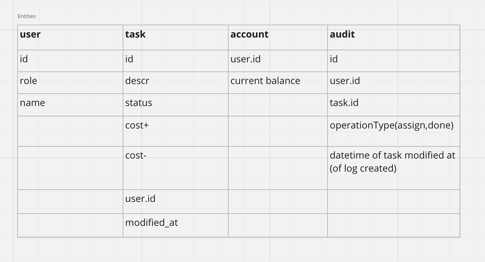

# asycArch
repo for async architecture lessons

Доска в миро (попытка номер два):
https://miro.com/app/board/uXjVM1BbegE=/?moveToWidget=3458764560929378256&cot=14

Event storming:

Data model:

Domains:

Services:

Data entities:

